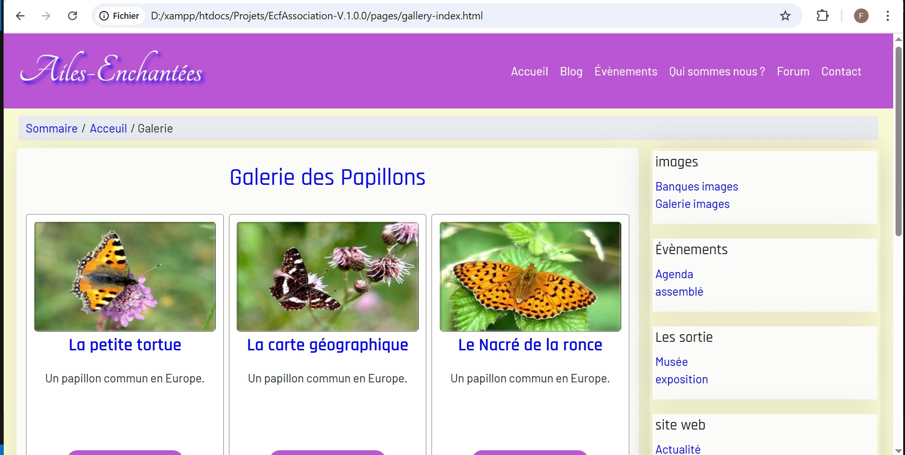

🏛️ Associations

Projet développé dans le cadre de l’ECF Studi 2024.
Ce site web permet la présentation et la gestion d’une association (services, événements, espace membre, etc.).

📌 Fonctionnalités principales

🔹 Page d’accueil avec présentation de l’association

🔹 Liste des événements ou projets en cours

🔹 Formulaire de contact pour les visiteurs

🔹 Espace membre (accès restreint selon les rôles)

🔹 Tableau de bord pour l’administration des contenus

🛠️ Stack technique

Front-end : HTML, CSS, JavaScript

Back-end : PHP

Base de données : MySQL

Serveur local : XAMPP (Apache, MySQL)

📂 Structure du projet
Associations/
│── assets/          # Images, CSS, JS
│── index.php        # Page d’accueil
│── pages/           # Pages publiques (événements, contact…)
│── admin/           # Tableau de bord et gestion
│── config/          # Connexion DB et configuration
│── database/        # Sauvegardes SQL

🚀 Installation et utilisation

Cloner le dépôt :

git clone https://github.com/exacodeweb/Associations.git

Placer le projet dans le dossier htdocs de XAMPP

Importer la base de données associations.sql (dans /database/)

Lancer Apache & MySQL depuis XAMPP

Accéder au site via :
👉 http://localhost/Associations

👤 Utilisateurs par défaut

Admin : admin@example.com
 / mot de passe haché

Membre : membre@example.com

⚠️ Modifier ces accès en production.

📸 Captures d’écran

📌 Versions

v1.0.0 : Première version (évaluation Studi)

main : Version finale 2024

📜 Licence

Projet réalisé dans le cadre de l’ECF Studi.
Utilisation libre à des fins pédagogiques.

🔮 Évolutions prévues

Ce projet pourra être enrichi à l’avenir :

Mise en place d’un framework PHP (Symfony ou Laravel)

Amélioration du design avec SCSS et un framework CSS (Bootstrap / Tailwind)

Ajout d’une section blog / actualités

Mise en ligne sur un hébergeur (GitHub Pages, Vercel, ou autre)